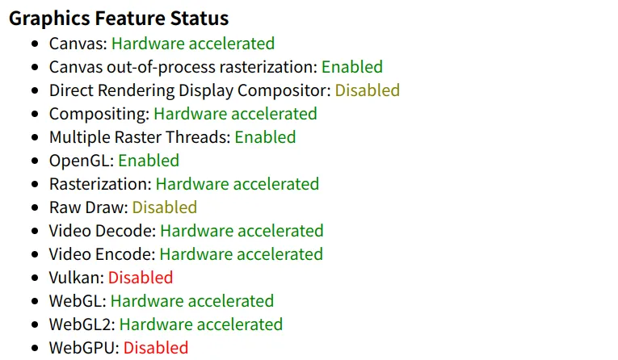
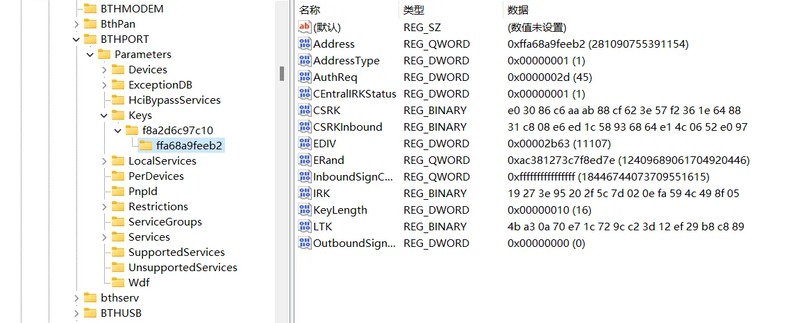
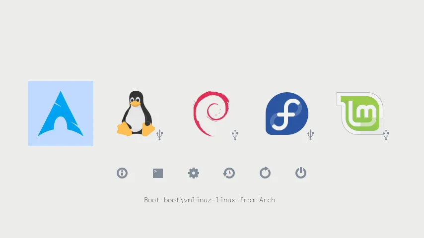

+++

title = "Arch Linux 配置 -- 驱动和软件安装"
date = 2023-07-08T17:40:07+08:00
slug = "arch-linux-configuration-driver-and-software"
description = "本文记录了Arch Linux安装后，安装显卡驱动、启用视频编解码加速、统一双系统蓝牙等系统配置的过程"
tags = ["Linux"]
categories = ["Notes"]
image = "arch.webp"

+++

最近趁着假期把Manjaro换成了Arch Linux，本文记录了我安装Arch Linux中的一些配置。

## Arch Linux安装

安装教程参考[archlinux 简明指南](https://arch.icekylin.online/)和[ArchWiki](https://wiki.archlinux.org/title/Installation_guide)。

## 安装显卡驱动

本人电脑是联想小新Air13 IWL，有一个Intel核显和一个Nvidia独显。

运行`lspci -k | grep -A 2 -E "(VGA|3D)"`可以查看显卡信息

```bash
00:02.0 VGA compatible controller: Intel Corporation WhiskeyLake-U GT2 [UHD Graphics 620]
       Subsystem: Lenovo WhiskeyLake-U GT2 [UHD Graphics 620]
       Kernel driver in use: i915
--
03:00.0 3D controller: NVIDIA Corporation GP108M [GeForce MX150] (rev a1)
       Subsystem: Lenovo GP108M [GeForce MX150]
       Kernel driver in use: nvidia
```

### Intel 驱动

参考[ArchWiki-Intel graphics](https://wiki.archlinux.org/title/Intel_graphics#Installation)。

首先安装`mesa`，它提供了用于3D加速得DRI驱动。对于Intel 8代以及更新的硬件选择软件包`mesa`，对于7代以及更老的芯片选择`mesa-amber`。

为了支持32位程序，同时安装对应的`lib32-mesa`或者`lib32-mesa-amber`。 为了Vulkan支持，还需要安装`vulkan-intel`，以及32位支持包`lib32-vulkan-intel`。

```bash
sudo pacman -S mesa lib32-mesa vulkan-intel lib32-vulkan-intel
```

### Nvidia 驱动

建议对照[ArchWiki-NVIDIA](https://wiki.archlinux.org/title/NVIDIA#Installation)安装，官方教程更加准确并且可能有更新。

- 对于新于 [Turing (NV160/TU*XXX*)](https://nouveau.freedesktop.org/CodeNames.html#NV160)系列的显卡，如果系统使用l`inux`内核则安装`nvidia-open`，如果使用其他内核则安装`nvidia-open-dkms`。
- 对于较旧且新于 [Maxwell (NV110/GM*XXX*)](https://nouveau.freedesktop.org/CodeNames.html#NV110)系列的显卡，如果使用`linux`内核则安装`nvidia`，如果使用`linux-lts`内核则安装`nvidia-lts`，其他内核则安装`nvidia-dkms`。
- [Kepler (NVE0/GK*XXX*)](https://nouveau.freedesktop.org/CodeNames.html#NVE0)系列显卡，安装`nvidia-470xx-dkms`。
- 更旧的显卡安装开源驱动`nouveau`。

如果需要32位应用支持，还需安装`lib32-nvidia-utils`。同时可以安装`nvidia-settings`用来对nvidia驱动进行一些配置。

```bash
sudo pacman -S nvidia nvidia-settings lib32-nvidia-utils
```

不同型号的显卡对应的软件包选择可以参考[archlinux 简明指南-显卡驱动](https://arch.icekylin.online/guide/rookie/graphic-driver.html#%E7%8B%AC%E7%AB%8B%E6%98%BE%E5%8D%A1)，最好同时对照ArchWiki选择。

安装好驱动后，编辑`/etc/mkinitcpio.conf`，删去`HOOKS`那一项中得`kms`，阻止内核启动时加载`nouveau`。

```bash
# HOOKS=(base udev autodetect modconf keyboard keymap kms consolefont block filesystems fsck)  # 更改前
HOOKS=(base udev autodetect modconf keyboard keymap consolefont block filesystems fsck)  # 更改后
```

更改后重新生成`initramfs`

```bash
sudo mkinitcpio -P
```

重启系统，打开`nvidia-settings`如果可以看到显卡的各种详细信息，则说明安装成功。

### 核显和独显动态切换

参考[双显卡（核显 + 独显）](https://arch.icekylin.online/guide/rookie/graphic-driver.html#%E5%8F%8C%E6%98%BE%E5%8D%A1-%E6%A0%B8%E6%98%BE-%E7%8B%AC%E6%98%BE) 。

安装`optimus-manager`，它提供了双显卡下切换仅用核显、仅用独显和动态切换三种模式，`optimus-manager-qt`则提供了模式切换的图形界面。

```bash
yay -S optimus-manager optimus-manager-qt
```

## 启用视频硬件加速

参考[ArchWiki-Hardware video acceleration](https://wiki.archlinux.org/title/Hardware_video_acceleration)。

首先安装驱动

```bash
sudo pacman -S intel-media-driver
```

不同型号的显卡需要安装的驱动包不同，具体要求可以查看ArchWiki。

此时可以使用MPV播放视频检验硬件加速是否启用

```bash
❯ mpv --hwdec=auto test.mp4
 (+) Video --vid=1 (*) (h264 1920x1080 29.970fps)
 (+) Audio --aid=1 (*) (aac 2ch 44100Hz)
Using hardware decoding (vaapi).
AO: [pulse] 44100Hz stereo 2ch float
VO: [gpu] 1920x1080 vaapi[nv12]
AV: 00:00:02 / 00:03:49 (1%) A-V:  0.000
```

从终端输出可以看到，此时硬件解码是正常的。

在浏览器中启用视频硬件加速参考[[HowTo] Enable Hardware Video Acceleration / Video Decode In Google Chrome, Brave, Vivaldi And Opera Browsers](https://forum.manjaro.org/t/howto-enable-hardware-video-acceleration-video-decode-in-google-chrome-brave-vivaldi-and-opera-browsers/51895)。以我使用的Vivaldi浏览器为例，只需要新建文件`~/.config/vivaldi-stable.conf`，在其中写入

```bash
--use-gl=angle
--ignore-gpu-blocklist
--enable-features=VaapiVideoEncoder,VaapiVideoDecoder,CanvasOopRasterization
--disable-features=UseChromeOSDirectVideoDecoder,UseSkiaRenderer
--disable-gpu-driver-workarounds
```

此时在浏览器中进入`vivaldi:gpu`，已经正常启用了硬件加速。



## Windows 和 Linux 共用蓝牙

安装双系统后，每次切换系统都需要重新配对蓝牙设备。但是可以通过改变Linux系统中蓝牙设备的配对参数，实现两个系统共用一个蓝牙配对，这些切换系统后旧不用重新配对，直接可以自动连接蓝牙了。

首先在Linux里配对蓝牙设备，然后重启进入Windows重新配对蓝牙。

下载[PSEXEC](https://learn.microsoft.com/en-us/sysinternals/downloads/psexec)，以管理员身份启动终端，进入PSEXEC解压后的文件夹，运行

```bash
./psexec.exe -s -i regedit
```

在打开的页面中展开`HKEY_LOCAL_MACHINE\SYSTEM\CurrentControlSet\Services\BTHPORT\Parameters\Keys`，里面有一个以Windows蓝牙控制器的MAC地址命名的文件夹，打开该文件夹，里面的文件夹名对应的是蓝牙设备的MAC地址，记下蓝牙设备的MAC地址和里面注册表的值。



重启进入Linux，进入`/var/lib/bluetooth`，其中有一个以Linux蓝牙管理器MAC地址命名的文件夹，进入该文件夹，里面的文件夹以蓝牙设备的MAC地址命令，把这个文件夹重命名为和Windows中相同的MAC地址值。例如在我的电脑中，Windows中MAC地址为`ffa68a9feeb2`，在Linux中就改为`FF:A6:8A:9F:EE:B2`。

```bash
F8:A2:D6:C9:7C:10  # Linux蓝牙管理器MAC地址
├── cache
│   └── FF:A6:8A:9F:EE:B2
├── FF:A6:8A:9F:EE:B2  # 蓝牙设备MAC地址，改成和Windows相同的值
│   ├── attributes
│   └── info
└── settings
```

然后编辑`FF:A6:8A:9F:EE:B2`中的info文件，将相关的蓝牙配对参数改为和Windows相同，需要更改的值如下

```bash
[LocalSignatureKey]
Key=E03086C6AAAB88CF623E57F2361E6488  # 和Windows中CSRK相同
Counter=0
Authenticated=false

[LongTermKey]
Key=4BA30A70E71C729CC23D12EF29B8C889  # 和Windows中LTK相同
Authenticated=0
EncSize=16
EDiv=11107  # 和Windows中EDIV相同
Rand=12409689061704920446  # 和Windows中ERand相同
```

重启蓝牙，蓝牙设备就会自动连接

```bash
sudo systemctl restart bluetooth
```

## 使用rEFInd引导系统

rEFInd是一个适用于UEFI的Boot Manager，支持自定义主题，可以替代界面简陋的GRUB，用来引导Linux和Windows双系统。 rEFInd和GRUB的关系可以参考[这里](https://neucrack.com/p/330)。首先安装rEFInd软件包

```bash
sudo pacman -S refind
```

将rEFInd引导文件安装到ESP分区

```bash
refind-install
```

配置rEFInd主题，我选择的主题是[refind-theme-regular](https://github.com/bobafetthotmail/refind-theme-regular)，自动安装命令如下

```bash
sudo bash -c "$(curl -fsSL https://raw.githubusercontent.com/bobafetthotmail/refind-theme-regular/master/install.sh)"
```

官方默认安装主题到`/boot/efi/EFI/refind/themes/refind-theme-regular`，如果在安装Arch时选择将ESP分区挂在在`/efi`的话，需要按照官方的手动安装指导将主题安装到`/efi/EFI/refind/themes/refind-theme-regular`。 最终的主题效果如下



如果引导页面有多余项的话，可以按键盘上的Delete键隐藏该启动项。如果未出现rEFInd引导页，可以在电脑的BIOS设置界面将rEFInd启动项置顶。

## 安装MATLAB

我在安装时采用的是MATLAB 2022a安装包，在终端运行安装脚本，出现报错

```bash
/home/xu/Downloads/R2022a_Linux/bin/glnxa64/MathWorksProductInstaller: error while loading shared libraries: libcrypt.so.1: cannot open shared object file: No such file or directory
```

这是由于系统缺少`libxcrypt`，使用pacman安装相应软件包

```bash
sudo pacman -S libxcrypt-compat
```

再次运行安装脚本，出现报错信息

```bash
terminate called after throwing an instance of 'std::runtime_error'
  what():  Failed to launch web window with error: Unable to launch the MATLABWindow application. The exit code was: 127
[1]    3019 IOT instruction (core dumped)  ./install
```

此时可以按照[ArchWiki-MATLAB](https://wiki.archlinux.org/title/MATLAB#Unable_to_launch_the_MATLABWindow_application)中的指导进行排查错误来源，为了找出为何MATLABWindow无法加载，在MATLAB安装文件中执行以下命令，查看输出的报错信息

```bash
./bin/glnxa64/MATLABWindow
./bin/glnxa64/MATLABWindow: error while loading shared libraries: libgtk-x11-2.0.so.0: cannot open shared object file: No such file or directory
```

可以看到系统中无法找到`libgtk-x11-2.0.so.0`，安装缺失的软件包

```bash
sudo pacman gtk2
```

再次运行`./bin/glnxa64/MATLABWindow`，出现错误信息

```bash
./bin/glnxa64/MATLABWindow: symbol lookup error: /usr/lib/libharfbuzz.so.0: undefined symbol: FT_Get_Color_Glyph_Layer
```

此时的报错信息已经和ArchWiki一致，按照说明添加环境变量，再次运行安装脚本

```bash
export LD_PRELOAD=/lib64/libfreetype.so
./install
```

这时MATLAB安装界面可以正常运行，正常安装即可。

如果在MATLAB运行时碰到问题，可以参考我之前写的[Manjaro Linux 安装 MATLAB](https://xland.cc/p/manjaro-linux-matlab/)，里面记录了诸如设置无法保存、无法开启OpenGL加速等各种问题。
