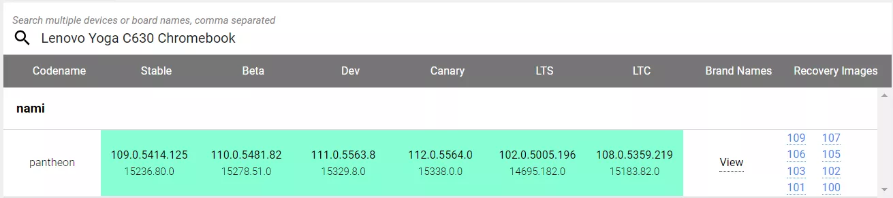
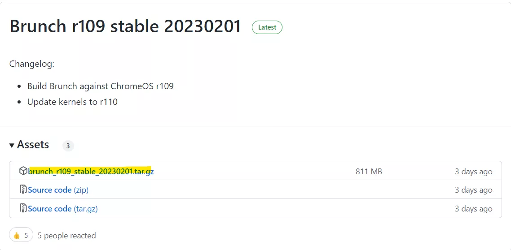
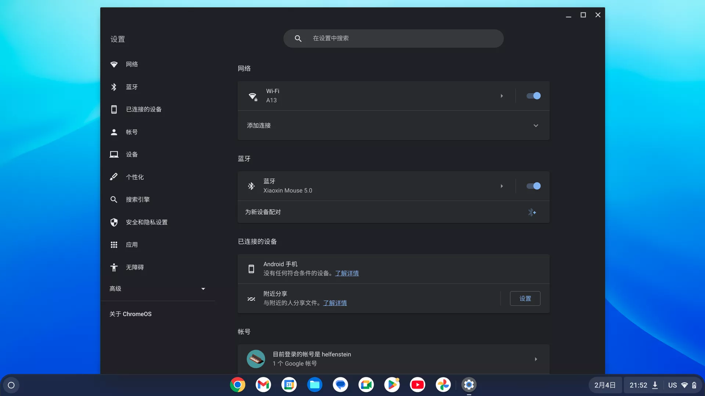

+++

title = "安装ChromeOS的U盘启动盘"
date = 2023-02-05T11:02:40+08:00
slug = "chromeos-usb-boot"
description = "借助brunch项目，将ChromeOS安装到非Chromebook设备"
tags = ["ChromeOS"]
categories = ["Tech"]
image = ""

+++

ChromeOS是Google推出的桌面操作系统，主打基于云应用的轻量操作系统，如今的ChromeOS已经支持Linux模式和直接运行Android应用。由于Google没有开放系统给Chromebook以外的设备，一般电脑安装ChromeOS可以借助开源项目[brunch](https://github.com/sebanc/brunch/blob/main/README.md#supported-hardware)。

brunch能够利用ChromeOS的recovery文件，生成可用的系统镜像文件，从而在非Chromebook上安装原生ChromeOS。

## 硬件要求

- x86_64架构，UEFI启动模式
- Intel CPU至少第四代，或者AMD Ryzen
- 不支持独显，不支持虚拟机，不支持Arm
- 可以安装Linux子系统（WSL2）的Windows或者Linux系统
- 空闲空间至少有16G

## 安装ChromeOS到U盘

1. 下载ChromeOS recovery文件。
    
    参考自己的CPU型号，选择一个和自己电脑配置接近的chrome设备，在[Chromium Dash](https://chromiumdash.appspot.com/serving-builds?deviceCategory=Chrome%20OS)下载该设备的recovery文件，一般选择最新的发行版本即可。
    
    
    
    我选择的是Lenovo Yoga C630 Chromebook，codename为pantheon，下载发行版本为109的recovery文件。
    
    如果不知道应该下载哪个recovery，brunch的项目文档里也给了[推荐的recovery](https://github.com/sebanc/brunch/blob/main/install-with-windows.md#recoveries)。
    
2. 下载brunch的release文件
    
    在brunch的[release](https://github.com/sebanc/brunch/releases)页面下载和recovery版本号对应的文件，例如下载的recovery为109，则下载Brunch r109。
    
    
    
3. 制作ChromeOS镜像文件
    
    将下载好的Brunch和ChromeOS recovery放在一个文件夹，分别解压。
    
    打开WSL终端，安装必要软件。
    
    ```bash
    sudo apt update && sudo apt -y install pv cgpt tar unzip
    ```
    
    在终端中运行命令，制作ChromeOS镜像。把`chromeos_filename.bin`用从recovery中解压得到的文件名替代，脚本运行完成后回到的名为`chromeos.img`的系统镜像。
    
    ```bash
    sudo bash chromeos-install.sh -src chromeos_filename.bin -dst chromeos.img
    ```
    
    命令运行完成后直接键入ENTER结束。
    
4. 将镜像文件写入U盘
    
    下载[Rufus](https://rufus.ie/)，选中要使用的U盘和镜像文件，将镜像写入U盘。
    
5. 进入ChromeOS
    
    重启电脑，进入BIOS设置界面，关闭secure boot，设置优先从USB启动。
    
    保存并退出BIOS设置，电脑会自动重启并从U盘启动系统，第一次进入系统时需要等待较长时间。
    
    
    

## 安装ChromeOS和Windows双系统

获取文件以及解压同“安装ChromeOS到Windows”中的步骤1、2、3。

安装ChromeOS双系统同样通过在WSL终端中运行脚本完成，首先新建一个文件夹用于安装系统如`/mnt/d/brunch`，表示在d盘新建文件夹brunch，然后输入命令。

```bash
sudo bash chromeos-install.sh -src chromeos_filename.bin -dst /mnt/d/brunch/chromeos.img -s size
```

把命令中的`chromeos_filename.bin`用从recovery中解压得到的文件名替代，size用一个数字替代，定义了分配给ChromeOS磁盘空间，不小于14并且为4的倍数（单位GB）。

等待脚本执行完成后输入`dualboot`然后键入ENTER。

下一步可以安装[Grub2Win](https://sourceforge.net/projects/grub2win/)，配置开机时选择进入的系统。本人未作尝试，具体步骤可以参考[brunch的官方安装教程](https://github.com/sebanc/brunch/blob/main/install-with-windows.md)。