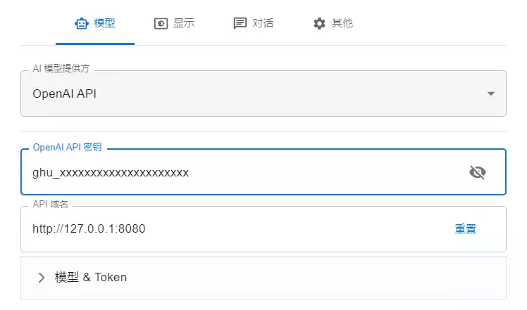
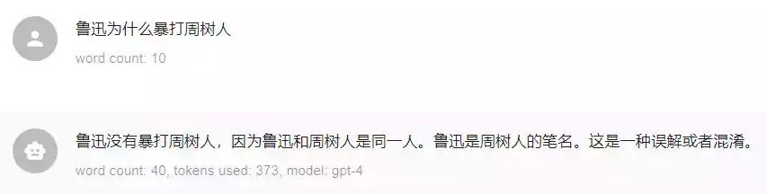
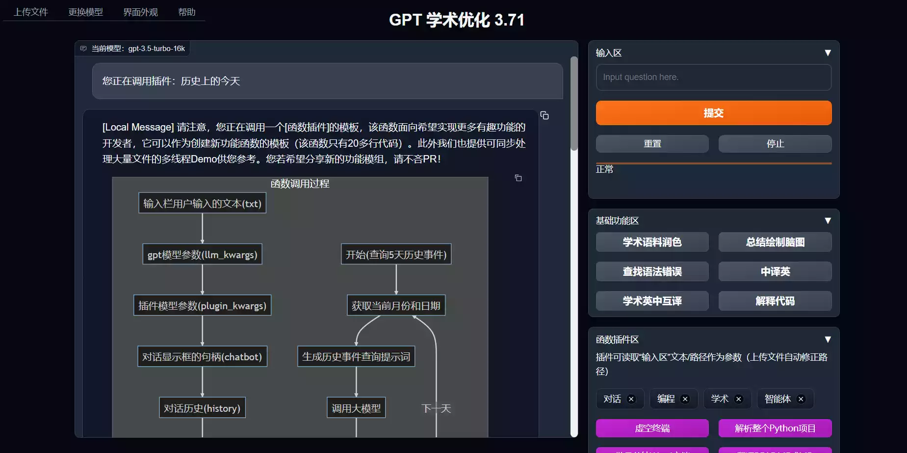

+++

title = "通过Github Copilot获取GPT-4 API"
date = 2024-02-12T15:19:19+08:00
slug = "get-access-to-gpt4-with-github-copilot"
description = "Github Copilot底层调用了GPT，本文介绍了如何通过Copilot获得GPT API，并搭配GPT前端使用GPT-4"
tags = ["工具"]
categories = ["Notes"]
image = ""

+++

最近Github向GitHub Student Developer Pack添加了无限使用Github Copilot的权益，大大提升了学生包的价值，学生认证后即可免费体验这款强大的AI编程助手。Github Copilot的实际体验让人不得不感慨AI的强大，Copilot自动补全的代码大多数情况下可以直接使用，大大提升了编程效率；Copilot Chat也可以对各种编程问题提供非常有用的建议。

除此之外，由于Github Copilot的底层使用了GPT，我们也可以通过Copilot免费使用GPT-4。要实现这样的功能只需要使用开源项目copilot-gpt4-service获取GPT API，然后就可以通过GPT API搭配GPT前端来访问GPT-4，此外还可以使用GPT API部署AI学术助手gpt academic。

- [copilot-gpt4-service](https://github.com/aaamoon/copilot-gpt4-service)：通过Github Copilot Plugin Token调用GPT API。
- [chatbox](https://github.com/Bin-Huang/chatbox)：GPT前端，搭配GPT API可以搭建自己的ChatGPT，并和GPT-4对话。
- [gpt_academic](https://github.com/binary-husky/gpt_academic)：使用GPT API的AI学术助手，支持英文论文润色，一键翻译论文等功能。

## 获取GPT API

从Copilot获取GPT API只需要两步

1. 运行copilot-gpt4-service得到一个API URL用来替代OpenAI的API URL
2. 获取Github Copilot Plugin Token代替OpenAI的API Key

### 编译可执行文件

copilot-gpt4-service使用Go语言编写，官方未提供编译好的可执行文件，所以只能自己编译，需要下载并安装[Go语言编译器](https://go.dev/dl/)，然后将源码下载到本地编译。

将[copilot-gpt4-service](https://github.com/aaamoon/copilot-gpt4-service)克隆到本地

```shell
git clone https://github.com/aaamoon/copilot-gpt4-service.git
```

编译源码，得到一个名为`main`的可执行文件

```shell
# 进入项目目录
cd copilot-gpt4-service
# 编译
go build main.go
```

在终端中执行可执行文件，此时程序会打印出程序运行的端口以及可用的API地址

```shell
./main
```

选择本地IP对应的API的地址`http://127.0.0.1:8080`，在浏览器中打开，如果出现下方提示表示程序运行正常

> Very important: please do not make this service public, for personal use only, otherwise the account or Copilot will be banned. 非常重要：请不要将此服务公开，仅供个人使用，否则账户或 Copilot 将被封禁。

### 获取Github Copilot Plugin Token

打开新的终端（如果关闭原本终端，正在运行的copilot-gpt4-service也会被关闭），运行Python脚本获取Github Copilot Plugin Token。

```shell
# 安装依赖库
pip install -r requests
# 运行脚本
python shells/get_copilot_token.py
```

根据终端输出的提示，在浏览器中打开Github验证页面，输入终端打印的认证码获取Github Copilot Plugin Token。

## 使用GPT前端

Chatbox是一款跨平台的GPT前端，可以使用GPT API搭建自己的ChatGPT，下载安装并填入GPT API的URL和Github Copilot Plugin Token即可使用。

下载并打开[chatbox](https://chatboxai.app)，进行如下设置：

- `AI模型提供方`选择`OpenAI API`
- `OpenAI API 密钥`填入上一步获取的Github Copilot Plugin Token
- `API 域名`填入`http://127.0.0.1:8080`
- `模型`选择`gpt-4`或者GPT的其他任意版本



为了验证API返回的结构是否来自GPT-4，可以提问`鲁迅为什么暴打周树人`，GPT-3.5会胡说八道，GPT-4会给出正确答案。



## 搭建GPT Academic

将项目克隆到本地，并进入项目目录

```shell
git clone https://github.com/binary-husky/gpt_academic.git
cd gpt_academic
```

安装依赖库

```shell
pip install -r requirements.txt
```

修改`config.py`中的下面几项

```shell
API_KEY = "ghu_xxxxx"  # Github Copilot Plugin Token

API_URL_REDIRECT = {"https://api.openai.com/v1/chat/completions": "http://127.0.0.1:8080/v1/chat/completions"}

CUSTOM_API_KEY_PATTERN = "ghu_[a-zA-Z0-9]{36}"

WEB_PORT = 1234  # 固定端口，也可以为其他值
```

运行程序，程序会自动在浏览器打开GPT Academic的页面，同样可以通过提问验证API配置是否正常

```shell
python main.py
```


