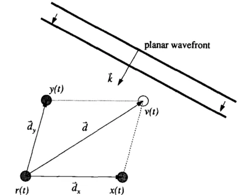
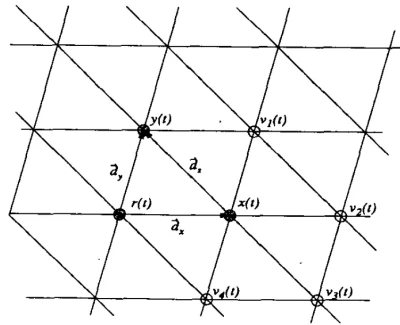
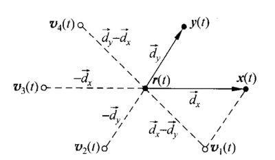

+++

title = "基于高阶累积量的DOA估计"
date = 2023-03-25T11:26:43+08:00
slug = "higer-order-statistics-doa-estimation"
description = "在DOA估计中，传统的子空间分解类算法只利用了阵列接受数据的二阶累积量。通过四阶累积量的引入，可以实现相关噪声下的DOA估计，同时四阶累积量也对阵列进行了扩展"
tags = ["DOA估计"]
categories = ["Tech"]
image = ""

+++

## 背景
传统的MUSIC算法和ESPRIT算法都指利用了接收信号的二阶累计量，这些算法的缺点主要有：
* 对于一个具有N个阵元的阵列，可估计的信号数最大为N-1
* 当阵列模型存在误差（eg. 算法中使用的流型矩阵和实际的流型矩阵不符），或者阵元接受到的噪声存在相关性的情况下，算法的鲁棒性很差
* 在较小快拍数下，对于角度邻近的信号估计精度较差
基于高阶累计量（Higher-order Cumulants）的DOA估计算法早期被用于处理不同阵元接收到的高斯噪声存在相关性的情况，随着研究的深入，人们发现高阶累积量的引入提高了阵列的可估计信号数和分辨率，同时对阵列模型误差存在一定的校正。
### 使用二阶累积量面临的问题
对于阵列接受信号
$${\bf{X}}(t) = {\bf{AS}}(t) + {\bf{N}}(t)$$
一般的子空间类分解算法是从接受信号的协方差矩阵，即二阶累积量组成的矩阵中提取角度信号
$${R_{xx}} = A{R_{ss}}A + {R_{nn}}$$
其中$R_{nn}$表示接受噪声的协方差矩阵。如果噪声是高斯白噪声，那么$R_{nn}=\sigma^2 I$，是一个对角元素等于噪声功率的对角阵，此时对$R_{xx}$做特征分解，可以得到
$$R_{xx} = \begin{bmatrix}U_{s}&U_{n}\end{bmatrix} 
\begin{bmatrix}
\sigma_1^2+\sigma^2&&& \newline 
&\sigma_2^2+\sigma^2&& \newline
&&\ddots& \newline
&&&\sigma^2
\end{bmatrix} 
\begin{bmatrix} U_{s} \newline U_{n}\end{bmatrix}$$
如果阵元接受到的噪声不是高斯白噪声，在DOA估计中主要表现为不同阵元接收到的噪声之间存在相关性，那么噪声的协方差矩阵$R_{nn}$不是一个对角阵，此时无法通过对接受信号协方差矩阵$R_{xx}$的特征分解确定信号子空间和噪声子空间。
### 高阶累计量对DOA估计的意义
如果接受到的噪声不是高斯白噪声，那么噪声的协方差矩阵不是对角阵，无法分解出噪声子空间和信号子空间。根据高阶累积量的性质，高斯随机过程的四阶累积量为0，如果接受噪声符合高斯随机分布，即使不同阵元接受到的噪声存在相关性，仍然可以通过四阶累积量构造新的协方差矩阵，实现去除噪声的目的。
## 四阶累积量的计算
对于一个$N\times 1$的实数值矢量x，它的第q阶累积量可以由它的矩表示  
$$Cum[{x_{{i_1}}},{x_{{i_2}}}, \ldots ,{x_{{i_q}}}] = \sum\limits_{p = 1}^q {{{( - 1)}^{p - 1}}(p - 1)!E\{ \prod\limits_{j \in {S_1}} {{x_{ij}}} \} } E\{ \prod\limits_{j \in {S_2}} {{x_{ij}}} \}  \cdots E\{ \prod\limits_{j \in {S_2}} {{x_{ij}}} \} $$  
对于一个零均值的矢量x，它的二阶、三阶和四阶累计量可以写成
$$Cum[{x_i},{x_j}] = E\{ {x_i}{x_j}\} $$
$$Cum[{x_i},{x_j},{x_k}] = E\{ {x_i}{x_j}{x_k}\} $$
$$Cum[{x_i},{x_j},{x_k},{x_l}] = E\{ {x_i}{x_j}{x_k}{x_l}\}  - E\{ {x_i}{x_j}\} E\{ {x_k}{x_l}\}  - E\{ {x_i}{x_k}\} E\{ {x_j}{x_l}\}  - E\{ {x_i}{x_l}\} E\{ {x_j}{x_k}\} $$

## 基于高阶累积量的DOA估计
### 接受信号模型
考虑一个具有N个阵元的阵列，阵列接收到P个入射信号（P的个数可以大于或等于N）。我们把P个信号划分成G组，其中第g组包含的信号数表示成$P_g$。位于同一组的信号不独立但也不相干，位于不同组的信号相互独立。此时可以写出阵元接受信号的数学模型
$$\bf{x_g}(t) = \bf{A_g}\bf{s_g}(t)$$
$${\bf{y}}(t) = \sum\limits_{g = 1}^G {{{\bf{A}}_g}{{\bf{S}}_g}(t) + {\bf{w}}(t)} $$
其中${{{\bf{S}}_g}(t)}$表示第g组入射信号复振幅，${{{\bf{A}}_g}}$表示第g组的入射信号对应流型矩阵。${{\bf{w}}(t)}$表示阵元接收到的噪声，假设该噪声符合高斯分布，不同阵元接受到的噪声之间存在相关性。
### 基于四阶累计量的MUSIC算法（MUSIC-Like Algorithm based on  FO Cumulant）
在求接收信号的四阶累积量时，采用复数形式的定义式  
$$Cum[y_i,y_j,y_{k}^{*},y_{l}^{*}] = E\{ y_i,y_j,y_k^*,y_l^*\} -E\{ y_i,y_j\} E\{ y_k^*,y_l^*\}  - E\{ y_i,y_k^*\} E\{ y_j,y_l^*\}  - E\{ y_i,y_l^*\} E\{ y_j,y_k^*\}$$
一般使用近似公式求解四阶矩和二阶矩
$$E\{ {y_i},{y_j},y_k^*,y_l^*\} = {1 \over L}\sum\limits_{t = 1}^L {{y_i}(t){y_j}(t)y_k^*(t)y_l^*(t)} $$
$$E\{ {y_i},{y_j}\}  = {1 \over L}\sum\limits_{t = 1}^L {{y_i}(t){y_j}(t)} $$
按照上述四阶累积量的近似计算公式计算$x_g(t)$的四阶累积量，如果取四阶累积量的下标i、j、k、l为不同值，总共可以求出$N^2\times N^2$个不同的四阶累计量，把它们写成一个$N^2\times N^2$维矩阵$C_g$的形式，每个四阶累积量作为$C_g$的一个元素。其中
$${C_g}[(i - 1)N + k,(j - 1)M + l] = Cum[{y_i},{y_j},y_k^*,y_l^*]$$
于是有
$${{\bf{C}}_g} = ({{\bf{A}}_g} \otimes {\bf{A}}_g^*){{\bf{S}}_g}{({{\bf{A}}_g} \otimes {\bf{A}}_g^*)^H}$$
其中
$$\begin{split} S_g &= E\{(s_g(t)\otimes s_g^*(t)) (s_g(t)\otimes s_g^*(t))^H\} \newline &- E\{s_g(t)\otimes s_g^*(t)\} E\{(s_g(t)\otimes s_g^*(t))^H\} \newline &- E\{s_g(t)\otimes s_g^H(t)\} E\{s_g(t)\otimes s_g^H(t)\}\end{split}$$
$S_g$表示第g组的接受信号的四阶累积量组成的$N^2\times N^2$维矩阵。  
**性质1**：如果随机变量$x_i$和$y_i$相互独立，那么有
$$cum\{x_1+y_1,x_2+y_2,\dots,x_n +y_n\}=cum\{x_1,x_2,\dots,x_n\}  +cum\{y_1,y_2,\dots,y_n\}$$
**性质2**：如果x是一个高斯随机过程，则它的高阶累积量（$k\ge2$)恒等于0  
由上述两个性质可得，在阵元接受到的噪声为高斯噪声的情况下，阵元接受数据y(t)的四阶累积量组成的$N^2\times N^2$维矩阵C为
$$C = \sum\limits_{g = 1}^G {{C_g}} $$
$$C=\begin{bmatrix}A_1\otimes A_1^*,\dots,A_G\otimes A_G^*\end{bmatrix} 
\begin{bmatrix}S_1&\dots&0\newline \vdots&\ddots&\vdots \newline 0& \dots&S_G \end{bmatrix} 
\begin{bmatrix}(A_1\otimes A_1)^H \newline \vdots \newline (A_G\otimes A_G)^H\end{bmatrix}$$
由于第g组内的入射信号互相不独立，$S_g$是满秩矩阵，所以$C_g$的秩为$N_g^2$，于是矩阵C的秩为$\sum\limits_{g = 1}^G {N_g^2 < {N^2}}$。如果G=1，即所有接受信号互相不独立，那么C的秩为$N^2$；如果G=P，即所有接受信号互相独立，C的秩为N。对C做奇异值分解
$$C=\begin{bmatrix}U_1&U_2\end{bmatrix}
\begin{bmatrix}\Lambda&0 \newline 0&0\end{bmatrix}
\begin{bmatrix}V_1^H \newline V_2^H\end{bmatrix}$$
其中$\Lambda$是一个$\sum\limits_{g = 1}^G {N_g^2}$维对角阵，于是可以根据C的奇异值中0元素对应的特征向量确定子空间$U_2$。  
由于${A_g} \otimes A_g^*$与$U_2$正交，可以确定与入射信号角度对应的导向矢量满足
$${[a(\theta ) \otimes {a^*}(\theta )]^H}{U_2} = 0$$
此时可以构造出类似于MUSIC算法的空间谱
$$P(\theta ) = {1 \over {||{{[a(\theta ) \otimes {a^*}(\theta )]}^H}{U_2}|{|^2}}}$$
**优缺点**：可以应用于接受信号互相不独立（不能完全相关）或者不同阵元接收到的噪声之间存在相关性（高斯噪声）的场景。提高了DOA估计的分辨率和最大可估计信号数。  
计算量较大，需要计算$N^4$个四阶累积量。对于信源发射信号不独立的情况，需要预先知道信号的分组情况来确定C的非零特征值数目。
## 四阶累积量带来的阵列扩展
对于一个任意阵列，以第一个阵元作为参考阵元，它的阵元位置可以表示成
$$[0,{\vec d_1},{\vec d_2}, \ldots ,{\vec d_{M-1}}]$$
阵列接收到的信号可以写成
$$\bf{X}(t)=\begin{bmatrix}s(t)&s(t)exp(-j\vec{d}_1 \cdot \vec{k})&\dots&s(t)exp(-j\vec{d}_{M-1}\cdot\vec{k})\end{bmatrix}^T$$
其中$\vec k = {{2\pi f} \over c}{\vec k_n}$，${\vec k_n}$表示入射信号方向的单位向量。  
接受信号的二阶累积量为  
$${\mu _{l,k}} = cum({x_l}(t),{x_k}(t)) = E\{ {x_l}^*(t),{x_k}(t)\}  = \sigma _s^2\exp ( ({\vec d_l} - {\vec d_k}) \cdot \vec k)$$
接受信号的协方差矩阵为
$$\bf{R}=\begin{bmatrix}
\mu_{0,0}&\mu_{0,1}&\dots&\mu_{0,M-1}\newline
\mu_{1,0}&\mu_{1,1}&\dots&\mu_{1,M-1}\newline
\vdots&\vdots&\ddots&\vdots\newline
\mu_{M-1,0}&\mu_{M-1,1}&\dots&\mu_{M-1,M-1}\newline
\end{bmatrix}$$

信号入射到任意阵列</img>

图中$r(t),x(t),y(t)$表示三个阵元接受到的信号，其中以$r(t)$处作为参考阵元，即$r(t)=s(t)$，图中$v(t)$表示离$r(t)$为$\vec d$的某点接受到的信号
$$v(t) = s(t)\exp ( - j\vec k \cdot \vec d)$$
$r(t)$和$v(t)$组成的二阶累积量为
$${\mu _{r,v}} = E\{ {r^*}(t)v(t)\}  = \sigma _s^2\exp ( - j\vec d \cdot \vec k)$$
$r(t),x(t),y(t)$组成的一种四阶累积量
$$\begin{split}
\mu_{r,x}^{r,y}&=cum\{r^*(t),x(t),r^*(t),y(t)\}\newline
&=cum\{s(t),s(t),s(t),s(t)\}exp(-j(\vec{d}_x+\vec{d}_y)\cdot\vec{k})\newline
&=\gamma_{4,s}exp(-j\vec{d}\cdot\vec{k})
\end{split}$$
所以我们可以得到四阶累积量和二阶累积量的关系
$$E\{ {r^*}(t)v(t)\}=\frac{\sigma_s^2}{\gamma_{4,s}}cum\{ {r^*}(t),x(t),{r^*}(t),y(t)\}$$
$${\mu _{r,v}}=\frac{\sigma_s^2}{\gamma_{4,s}}\mu _{r,x}^{r,y}$$
也即是说，通过求实际阵元$r,x,y$的四阶累积量，我们得到虚拟阵元v和实际阵元s之间的二阶累积量。并且它们在集合上有如下关系
$$\overrightarrow {rv}  = \overrightarrow {rx}  + \overrightarrow {ry} $$

同理可以得到
$$E\{ {r^*}(t)y(t)\}  = {{\sigma _s^2} \over {{\gamma _{4,s}}}}cum\{ {r^*}(t),y(t),{r^*}(t),r(t)\} $$
$$E\{ {y^*}(t){v_4}(t)\}  = {{\sigma _s^2} \over {{\gamma _{4,s}}}}cum\{ {y^*}(t),r(t),{y^*}(t),x(t)\} $$
$$E\{ {v_1}^*(t){v_3}(t)\}  = {{\sigma _s^2} \over {{\gamma _{4,s}}}}cum\{ {y^*}(t),x(t),{y^*}(t),r(t)\} $$
在前面所讨论的*基于四阶累计量的MUSIC算法*中，我们用接受数据的四阶累积量组成了一个$M^2\times M^2$维的矩阵C，C中每一个元素都是由4个阵元的接受数据组成的四阶累积量$cum[{y_i},{y_j},y_k^*,y_l^*]$。  
实际上它是对原本的M个阵元进行了扩展得到了一个虚拟阵列，每一个四阶累积量对应了经过这个虚拟阵列中两个阵元的接受数据组成的二阶累积量。所以$M^2\times M^2$维的矩阵C实际上是经过扩展后的虚拟阵列的协方差矩阵。  
四阶累积量组成的$M^2\times M^2$维的矩阵C为
$${{\bf{C}}} = ({{\bf{A}}} \otimes {\bf{A}}^*){{\bf{S}}}{({{\bf{A}}} \otimes {\bf{A}}^*)^H}$$
此时的流型矩阵为
$$\bf{A}\otimes\bf{A}^*=\begin{bmatrix}a(\theta_1)\otimes a^*(\theta_1)&\dots&a(\theta_N)\otimes a^*(\theta_N) \end{bmatrix}$$

以一个三阵元的阵列为例，三个实际存在的阵元分别为$r,y,x$，经过四阶累积量扩展后的流型矩阵为
$$\begin{split}b(\theta)&=a(\theta)\otimes a^*(\theta)\newline
&=\begin{bmatrix}1&exp(-jk\vec{d}_x)&exp(-jk\vec{d}_y)\end{bmatrix}^T\otimes
\begin{bmatrix}1&exp(jk\vec{d}_x)&exp(jk\vec{d}_y)\end{bmatrix}^T\newline
&=\begin{bmatrix}1&exp(jk\vec{d}_x)&exp(jk\vec{d}_y)&exp(-jk\vec{d}_y)&1&exp(-jk(\vec{d}_x-\vec{d}_y))&exp(-jk\vec{d}_y)&exp(-jk(\vec{d}_y-\vec{d}_x))&1\end{bmatrix}^T
\end{split}$$
可以看出此时3个阵元的阵列经过四阶累积量扩展，得到的流型矩阵扩展为9个元素，其中除了实际存在的3个阵元外，还有4个虚拟阵元。  
对于某些结构的阵列，经过四阶累积量的扩展，相当于加入了虚拟阵元，从而提升可估计的信号个数，提高了DOA估计算法的分辨率。
