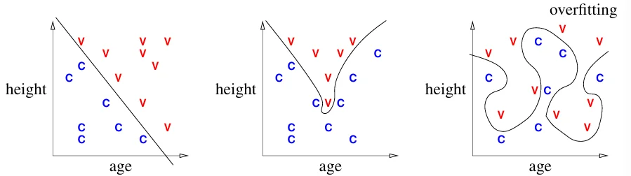

+++

title = "机器学习 02 线性分类器和感知机"
date = 2025-05-18T16:32:02+08:00
slug = "ml_02_linear_classifiers_and_perceptrons"
description = "线性分类器；决策函数和决策边界；质心法；感知机"
tags = ["机器学习"]
categories = ["Notes"]
image = "/p/ml_01_introduction/ml_header.webp"

+++

## 分类器

假设我们有 $n$ 个观测样例（bofservations），每个观测样例有 $d$ 个特征（features），有些样例属于类别 C，有些不是



<!--  -->

_决策边界_：分类器选择的可以将样例分成不同类别的边界

_过拟合_：决策边界拟合得太好，以至于无法用于未来样本的分类

_决策函数_：将一个点映射到一个值，例如

$$
\begin{matrix}
f(x) > 0 & & \text{if } x \in \text{class } C; \\
f(x) \le 0 & & \text{if } x \notin \text{class } C;
\end{matrix}
$$

则分类边界为 $\{x\in \mathbb{R}^{d}: f(x)=0\}$



## Linear Classifier Math

_内积_：$x\cdot y = x_1y_1+x_2y_2+\dots + x_dy_d$，也可以写成 $x^Ty$

_欧拉范数_：$\|x\|=\sqrt{x\cdot x}=\sqrt{x_1^2 + x_2^2 + \dots + x_d^2}$。可以表示向量 $x$ 的欧拉长度 (Euclidean length)。

归一化向量 $x$： ${x}/{\|x\|}$

给定一个线性决策函数 $f(x) = w \cdot x + \alpha$，决策边界为 $H = \{x: w \cdot x = -\alpha\}$。集合 $H$ 被称为*超平面*（hyperplane）。

- 超平面是 $d-1$ 维，并且分割了一个 $d$ 维空间
- 它是无限且平展的

$w$ 和超平面 $H$ 上的任何直线正交。所以 $w$ 被称为 $H$ 的*法线*（normal vector）。如果 $w$ 是一个单位向量，那么 $f(x) = w \cdot x + \alpha$ 是 $x$ 到 $H$ 的有符号距离（singed distance）。此外，$H$ 到原点的距离为 $\alpha$。



如果存在一个超平面可以将所有的训练样本点分类，则它们*线性可分*。

## 一个简单的分类器

_质心法_（Centroid method）：首先分别计算属于类别 $C$ 的所有点的平均 $\mu_C$，以及所有不属于 $C$ 的平均 $\mu_X$。则决策函数可以表示为
$$f(x) = (\mu_C - \mu_X) \cdot x - (\mu_C - \mu_X) \cdot \frac{\mu_C + \mu_X}{2}$$

质心法非常简洁，但是也只能处理简单的情况。例如下图中的数据点无法使用质心法正确分类。



## 感知机

假设有 $n$ 个采样点数据 $X_1, X_2,\dots,X_n$。对于每个采样点，对应的*标签*为

$$
y_i = \begin{cases}
\begin{matrix}
1 & \text{if } X_i \in \text{class C} \\
-1 & \text{if } X_i \notin \text{class C}
\end{matrix}
\end{cases}
$$

为了简化讨论，这里只考虑经过原点的决策边界。于是我们寻找决策边界的目标可以转换成寻找一个权重 $w$，使其满足

$$
\begin{matrix}
X_i \cdot w \ge 0 & & \text{if } y_i = 1 \\
X_i \cdot w \le 0 & & \text{if } y_i = -1
\end{matrix}
$$

等价为
$$y_iX_i\cdot w \ge 0$$
上式即为*约束*（constraint）。

为了找到最优的 $w$，我们定义一个*风险函数*$R$，如果约束被违背，则风险函数为正值，然后通过最小化 $R$ 选择最优 $w$。

首先定义*损失函数*

$$
L(\hat{y}, y_i) = \begin{cases}
\begin{matrix}
0 & & \text{if } y_i\hat{y} \ge 0 \\
-y_i \hat{y} & & \text{otherwise}
\end{matrix}
\end{cases}
$$

其中 $\hat{y}$ 是分类器的预测值。

于是，我们可以定义风险函数（即优化问题的目标函数）为
$$R(w) = \frac{1}{n} \sum_{i = 1}^n L(X_i \cdot w, y_i) = \frac{1}{n} \sum_{i = 1}^n -y_iX_i \cdot w$$
所以寻找超平面的问题变为一个最优化问题：寻找 $w$ ，使得 $R(w)$ 最小。
