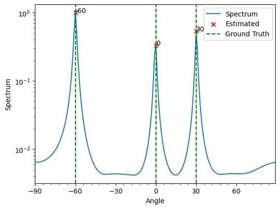
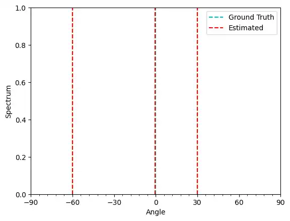
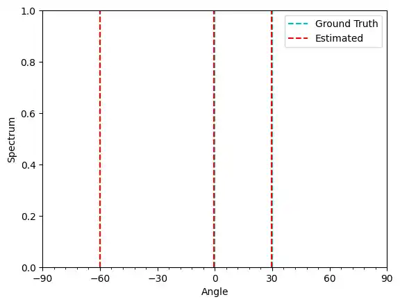
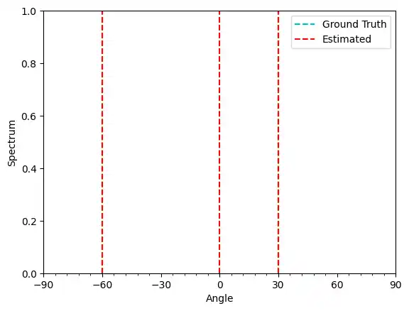

+++

title = "用于 DOA 估计的 Python 包 DOA_py"
date = 2024-07-07T10:59:51+08:00
slug = "python_package_doa_estimation"
description = "为了方便 DOA 估计的研究，我开发了一个 Python 包 DOA_py，实现了一些经典的DOA估计算法，支持均匀线阵、均匀圆阵和宽带DOA估计。"
tags = ["Python", "DOA 估计"]
categories = ["Tech"]
image = ""

+++

## 项目地址

[DOA_py: DOA etimation algorithms implemented in Python for ULA, UCA and broadband/wideband DOA estimation](https://github.com/zhiim/doa_py)

## 安装

使用 pip 或者从源码安装

```bash
# pip 安装
pip install doa_py
# 从源码安装
git clone https://github.com/zhiim/doa_py.git
cd doa_py
pip install .
```

## 使用案例（均匀线阵）

```python
import numpy as np
```

### Import Signal 和 Array

`signal.py`定义了一些常用的信号类型，信号对应的 Class 都继承自`Signal`基类, 用于产生多个入射信号  
`array.py`定义了一些常用的阵列结构，所有的阵列对应的 Class 都继承自`Array`基类，`Array`会使用`Signal`产生的信号以及入射角度，根据阵列接受信号的数学模型生成阵列接受信号的仿真数据

阵列接收信号的数学模型（窄带信号）:
$\bf{X} = \bf{A} \bf{S}$

其中：
$\bf{X} = \begin{bmatrix}
x_1(t) & x_2(t) & \dots & x_M(t)
\end{bmatrix}^T$ 是一个$M\times 1$维的向量，表示阵列接收到的信号

$\bf{A} = \begin{bmatrix}
\bf{a}(\theta_1) & \bf{a}(\theta_2) & \dots & \bf{a}(\theta_N)
\end{bmatrix}$ 是一个$M \times N$维的矩阵，表示阵列的流型矩阵  
$\bf{a}(\theta_n) =\begin{bmatrix}
e^{-j \omega_0 \tau_{1n}} & e^{-j \omega_0 \tau_{2n}} \dots & e^{-j \omega_0 \tau_{Mn}}
\end{bmatrix}^T$是与入射角度对应的导向矢量

$\bf{X} = \begin{bmatrix}
s_1(t) & s_2(t) & \dots & s_N(t)
\end{bmatrix}^T$ 是一个$N\times 1$维的向量，表示入射的信号

```python
from doa_py.arrays import UniformLinearArray
from doa_py.signals import ComplexStochasticSignal
```

### 设定仿真参数

设定与阵列结构以及信号参数、入射方向有关的仿真参数，产生采样后的阵列接受信号

```python
# 信号参数
num_snapshots = 300
signal_fre = 2e7
fc = 5e7
snr = 0

# 阵列参数
num_antennas = 8
antenna_spacing = 0.5 * (3e8 / signal_fre)  # 阵元间距半波长

# 入射角度
angle_incidence = np.array([0, 30, -60])
num_signal = len(angle_incidence)
```

### 生成仿真信号

创建`Array`和`Signal`的实例，并生成阵列接受信号的仿真数据

```python
# 创建信号实例
signal = ComplexStochasticSignal(fc=fc)

# 创建阵列实例
array = UniformLinearArray(m=num_antennas, dd=antenna_spacing)

# 使用信号和阵列生成仿真数据
received_data = array.received_signal(
    signal=signal, snr=snr, nsamples=1000, angle_incidence=angle_incidence, unit="deg"
)
```

### 估计入射角

`algorithm`中定义了几种经典的 DOA 估计算法，有些算法会输出空间谱，有些算法会直接输出估计的入射角的值  
首先 import 两个和绘图函数，分别用于展示这两种算法的估计结果

```python
from doa_py.plot import plot_estimated_value, plot_spatial_spectrum
```

#### MUSIC 算法

```python
search_grids = np.arange(-90, 90, 1)

from doa_py.algorithm.music import music

music_spectrum = music(
    received_data=received_data,
    num_signal=num_signal,
    array=array,
    signal_fre=signal_fre,
    angle_grids=search_grids,
    unit="deg",
)

# 绘制空间谱
plot_spatial_spectrum(
    spectrum=music_spectrum,
    angle_grids=search_grids,
    ground_truth=angle_incidence,
    num_signal=num_signal,
)
```



#### Root-MUSIC 算法

```python
from doa_py.algorithm.music import root_music

rmusic_estimates = root_music(
    received_data=received_data,
    num_signal=num_signal,
    array=array,
    signal_fre=signal_fre,
    unit="deg",
)
plot_estimated_value(estimates=rmusic_estimates, ground_truth=angle_incidence)
```



#### ESPRIT 算法

```python
from doa_py.algorithm.esprit import esprit

esprit_estimates = esprit(
    received_data=received_data,
    num_signal=num_signal,
    array=array,
    signal_fre=signal_fre,
)

plot_estimated_value(estimates=esprit_estimates, ground_truth=angle_incidence)
```



#### OMP 算法

```python
from doa_py.algorithm.sparse import omp

omp_estimates = omp(
    received_data=received_data,
    num_signal=num_signal,
    array=array,
    signal_fre=signal_fre,
    angle_grids=search_grids,
    unit="deg",
)

plot_estimated_value(estimates=omp_estimates, ground_truth=angle_incidence)
```



## 更多

查看[项目仓库](https://github.com/zhiim/doa_py/tree/master/examples)，了解更多的功能和使用方法
