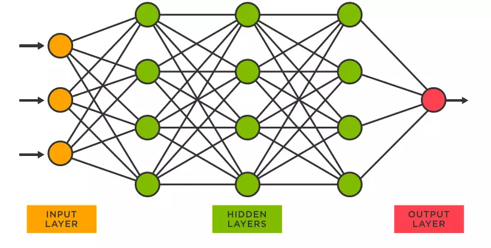
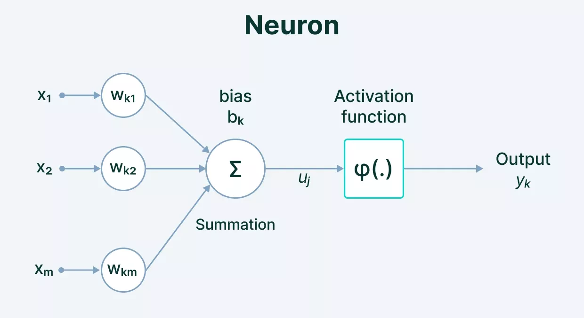

+++

title = "PyTorch基础 网络模型"
date = 2023-01-09T15:14:55+08:00
slug = "pytorch-model"
description = "在PyTorch中建立神经网络模型，初始化和查看模型参数"
tags = ["PyTorch"]
categories = ["Tech"]
image = ""

+++

## 神经网络 neural network

神经网络由多个神经元互相连接组成，每个神经元是一个计算单元，位于同一层级的多个神经元组成一个网络层。一般的神经网络一般由三种网络层组成：输入层，隐藏层和输出层。



### 神经网络的组成

- **激活函数 Activatioin Functioin**
    
    神经元的输入经过激活函数得到输出，激活函数的输出值定义了神经元是否被激活。激活函数有几种不同的形式，它的选取取决于期望的神经元输出。
    
    - *Binary* 输入为正数时神经元输出1，输入为负数时神经元输出0
        
        $$
        f(x)= \small\begin{cases} 0, & \text{if } x < 0 \newline 1, & \text{if } x\geq 0 \end{cases}
        $$
        
    - *Sigmod* 由输入值得到0和1之间的连续输出值
        
        $$
        f(x) = {\large \frac{1}{1+e^{-x}}}
        $$
        
    - *Tanh* 由输入值得到-1和1之间的连续输出值
        
        $$
        f(x) = {\large \frac{e^{x} - e^{-x}}{e^{x} + e^{-x}}}
        $$
        
    - *ReLU* 当输入为负数时输出为0，输入为正数时保持输入值
        
        $$
        f(x)= \small \begin{cases} 0, & \text{if } x < 0\newline x, & \text{if } x\geq 0 \end{cases}
        $$
        
- **权重 Weights**
    
    由前一神经元输出到下一神经元输入的加权
    
- **偏置 Bias**



$$
output=activation function(\sum{(weights * inputs) + bias})
$$

## 在PyTorch中建立神经网络

`torch.nn`提供了建立神经网络需要的组件，在PyTorch中神经网络是一个module，一个神经网络由多个同样是module的网络层组成。所有的神经网络模型都是`nn.Module`的子类。

```python
import os
import torch
from torch import nn
from torch.utils.data import DataLoader
from torchvision import datasets, transforms

device = 'cuda' if torch.cuda.is_available() else 'cpu'
print('Using {} device'.format(device))

class NeuralNetwork(nn.Module):
    def __init__(self):
        super(NeuralNetwork, self).__init__()
        self.flatten = nn.Flatten()
        self.linear_relu_stack = nn.Sequential(
            nn.Linear(28*28, 512),
            nn.ReLU(),
            nn.Linear(512, 512),
            nn.ReLU(),
            nn.Linear(512, 10),
            nn.ReLU()
        )

    def forward(self, x):
        x = self.flatten(x)
        logits = self.linear_relu_stack(x)
        return logits

model = NeuralNetwork().to(device)
```

通过向模型传递输入数据，模型会自动调用forward()，并返回模型输出。

```python
X = torch.rand(1, 28, 28, device=device)  # 生成模型输入数据
logits = model(X)  # 向模型传递输入数据，model.forward()自动执行，得到输出logits
pred_probab = nn.Softmax(dim=1)(logits)
y_pred = pred_probab.argmax(1)
print(f"Predicted class: {y_pred}")
```

### nn.Linear

`nn.Linear`随机初始化每层的权重和偏置，并储存在tensors中

### nn.Flatten

`nn.Flatten`将28x28的图片转换为一个784维的输入向量

### nn.Sequential

`nn.Sequential`是一个module的容器，数据经过`nn.Sequential`后，会按照定义时的顺序，依次进行运算。

```python
self.linear_relu_stack = nn.Sequential(
            nn.Linear(28*28, 512),
            nn.ReLU(),
            nn.Linear(512, 512),
            nn.ReLU()
        )

logits = self.linear_relu_stack(x)
# x输入linear_relu_stack后，依次经过module nn.Linear(28*28, 512)，
# nn.ReLU()，nn.Linear(512, 512)，nn.ReLU()
```

### nn.ReLU

激活函数ReLU

## 模型参数

神经网络的参数包括每一个网络层的weight和bais，通过模型的`parameters()`或`named_parameters()`可以获取模型中的所有参数

```python
print("Model structure: ", model, "\n\n")

for name, param in model.named_parameters():
    print(f"Layer: {name} | Size: {param.size()} | Values : {param[:2]} \n")
```