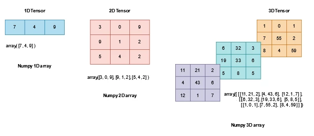

+++

title = "PyTorch基础 （一）Tensors"
date = 2023-01-06T17:12:03+08:00
slug = "pytorch-tensor"
description = "PyTorch学习笔记，Tensor的创建、Tensor的属性和Tensor的数学运算"
tags = ["PyTorch"]
categories = ["Tech"]
image = "pytorch.webp"

+++

张量（tensor）是一种类似于数组和矩阵的特殊数据结构。tensor类似于NumPy中的ndarray，两者也可以使用相同的内存地址。



## 创建Tensor
### 直接使用数据创建
```python
import torch
import numpy as np

data = [[1, 2],[3, 4]]
x_data = torch.tensor(data)
```
### 使用NumPy array创建
```python
np_array = np.array(data)
x_np = torch.from_numpy(np_array)

print(f"Numpy np_array value: \n {np_array} \n")
print(f"Tensor x_np value: \n {x_np} \n")

np.multiply(np_array, 2, out=np_array)
print(f"Numpy np_array after * 2 operation: \n {np_array} \n")
# x_np会和np_array一起改变
print(f"Tensor x_np value after modifying numpy array: \n {x_np} \n")
```
由于`np_array`和`x_np`使用相同的内存地址，两者的值会同时改变
### 使用其他tensor创建
tensor可以使用其他tensor的属性（包括tensor的shape，dtype）进行初始化
```python
x_ones = torch.ones_like(x_data)
# x_ones会保持和x_data相同的属性，所有元素都为1
print(f"Ones Tensor: \n {x_ones} \n")

x_rand = torch.rand_like(x_data, dtype=torch.float)
# x_rand保持x_data的属性，dtype设为torch.float
print(f"Random Tensor: \n {x_rand} \n")
```
### 使用随机数或常数创建
```python
shape = (2,3,)
rand_tensor = torch.rand(shape)
ones_tensor = torch.ones(shape)
zeros_tensor = torch.zeros(shape)

print(f"Random Tensor: \n {rand_tensor} \n")
print(f"Ones Tensor: \n {ones_tensor} \n")
print(f"Zeros Tensor: \n {zeros_tensor}")
```
## Tensor的属性
```python
tensor = torch.rand(3,4)

print(f"Shape of tensor: {tensor.shape}")
print(f"Datatype of tensor: {tensor.dtype}")
print(f"Device tensor is stored on: {tensor.device}")
```
tensor的属性包括维度shape，数据类型dtype，和存储的设备类型device
## Tensor的操作
[tensor的参考文档](https://pytorch.org/docs/stable/torch.html)
tensor创建时默认处于CPU中，如果要使用GPU进行tensor计算需要使用`.to`设置
```python
# 当GPU可用时，将tensor转移到GPU中
if torch.cuda.is_available():
  tensor = tensor.to('cuda')
```
### Tensor索引
```python
tensor = torch.ones(4, 4)
print('First row: ',tensor[0])
print('First column: ', tensor[:, 0]) # 第一列
print('Last column:', tensor[..., -1]) # 最后一列
tensor[:,1] = 0 # 第二列元素置为0
print(tensor)
```
### Tensor合并
tensor的合并有两种方法`torch.cat`和`torch.stack`
```python
t1 = torch.cat([tensor, tensor, tensor], dim=1)
t1 = torch.stack([tensor, tensor, tensor], dim=1)
```
### Tensor的数学运算
```python
# 矩阵乘法
y1 = tensor @ tensor.T
y2 = tensor.matmul(tensor.T)

y3 = torch.rand_like(tensor)
torch.matmul(tensor, tensor.T, out=y3)

# 矩阵对应元素相乘
z1 = tensor * tensor
z2 = tensor.mul(tensor)

z3 = torch.rand_like(tensor)
torch.mul(tensor, tensor, out=z3)
```
### 单元素的tensor
单元素的tensor可以使用`item()`转变为Python中的数值量
```python
agg = tensor.sum()  # 将tensor中的元素相加
agg_item = agg.item()  # 将单元素agg转为Python数值
print(agg_item, type(agg_item))
```
### 自动赋值运算
自动赋值运算通常在方法后有 `_` 作为后缀，在运算中会直接改变运算量
```python
print(tensor, "\n")
tensor.add_(5)  # add_改变了tensor的元素值，每个元素加上5
print(tensor)
```
### Tensor和NumPy
#### Tensor转为NumPy array
```python
t = torch.ones(5)
print(f"t: {t}")
n = t.numpy()
print(f"n: {n}")
```
tensor和NumPy array共享内存，两者会同时改变
#### NumPy array转为Tensor
```python
n = np.ones(5)
t = torch.from_numpy(n)
```