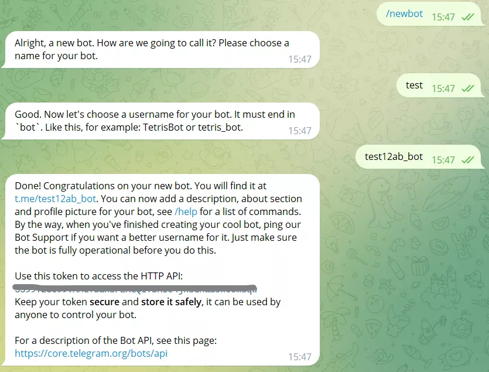

+++

title = "Telegram Bot （一）基础"
date = 2023-01-10T19:39:43+08:00
slug = "telegram-bot"
description = "Telegram Bot的基本原理和Python库pyTelegramBotAPI的使用"
tags = ["Telegram Bot","pyTelegramBotAPI"]
categories = ["Tech"]
image = ""

+++

基于Python的Telegram Bot，使用[pyTelegramBotAPI](https://github.com/eternnoir/pyTelegramBotAPI)库。

## 准备

### 创建Bot

点击START私聊[@BotFather](https://t.me/botfather)，输入/newbot开始创建Bot。



等到BotFather回复后输入想要创建的Bot名称，BotFather再次回复后输入Bot的username，注意username必须以_bot结尾。

创建完Bot后就可以获取到Bot的token，Telegram Bot API的调用必须提供token。

### 安装pyTelegramBotAPI

使用pip安装pyTelegramBotAPI。

```python
pip install pyTelegramBotAPI
```

## Bot的运行原理

Bot和一般的用户一样，都有名称和id，可以通过@username查找到Bot。Bot的运行是通过和所有者服务器上的脚本联合实现的，用户通过Telegram向Bot发送信息，Bot的脚本根据Bot的token，就可以在服务器上通过Telegram提供的Bot API获取到用户发送给Bot的信息，从而实现根据用户发送的信息返回给用户相应的回复。

pyTelegramBotAPI是一个Python库，对Telegram Bot API进行了封装。使得开发者不用对API直接调用，使用pyTelegramBotAPI提供的函数和类就可以实现Telegram Bot API的各种功能。

## pyTelegramBotAPI的基础使用

### 新建bot对象

pyTelegramBotAPI中调用API的methods全部定义在TeleBot类中，通过传入Bot token新建bot对象。

```python
import telebot

bot = telebot.TeleBot("TOKEN", parse_mode=None) # You can set parse_mode by default. HTML or MARKDOWN
```

TeleBot类中的函数和Telegram Bot API提供的method同名，但是更改了命名规则，例如API中的`getMe`在TeleBot类对应于`get_me`，API中的`sendMessage`被命名为`send_message`。

Bot提供给用户的回复是通过handler实现的，对于用户发送给Bot的消息，使用message handler进行处理。

```python
@bot.message_handler(commands=['start', 'help'])
def send_welcome(message):
	bot.reply_to(message, "Howdy, how are you doing?")
```

上述代码中表示对于用户发送给Bot的消息，定义一个`message_handler`，这个`message_handler`在用户发送了指令/start或/help时执行`send_welcome`函数，产生对用户的回复”Howdy, how are you doing?“。

### message对象

用户对Bot发送消息后，通过Telegram Bot API获得到的是一个名为[message](https://core.telegram.org/bots/api#message)的JSON对象，包含了消息内容，用户id等相关信息，详情可参考Telegram官方文档。

在上述给出的`message_handler`示例代码中，`send_welcome`函数传入参数message对象，`reply_to`通过message中包含的属性`chat.id`等获取用户id，从而向用户发送回复信息。

需要注意的是，由于`from`是Python中的保留字，在pyTelegramBotAPI中，`message`的属性名`from`被替换为`from_user`。

### message handler

message handler用来对用户发送的message类消息做出反应（用户发送的消息一般都为message，除此之外还有投票poll、频道推文channel post等其他类型），用于处理其他类消息的handler还有poll handler、channel post handler等。

```python
@bot.message_handler(filters)
def function_name(message):
	bot.reply_to(message, "This is a message handler")
```

在message handler的一般形式中，`filters`用来对message进行筛选，使该`message_handler`只对特定类型的message进行响应。`filters`的一般格式为`name=argument`，name表示筛选类型，argument代表筛选范围。例如`commands=['start', 'help']`表示只对命令/start和/help做出反应。

官方给出的filters支持的类型如下：

| name | argument | Condition |
| --- | --- | --- |
| content_types | list of strings (default ['text']) | True if message.content_type is in the list of strings. |
| regexp | a regular expression as a string | True if re.search(regexp_arg) returns True and message.content_type == 'text' (See https://docs.python.org/2/library/re.html) |
| commands | list of strings | True if message.content_type == 'text' and message.text starts with a command that is in the list of strings. |
| chat_types | list of chat types | True if message.chat.type in your filter |
| func | a function (lambda or function reference) | True if the lambda or function reference returns True |

```python
import telebot
bot = telebot.TeleBot("TOKEN")

# 只处理命令 '/start' 和 '/help'
@bot.message_handler(commands=['start', 'help'])
def handle_start_help(message):
	pass

# 只处理用户发送内容为“文件”和“音频”的message
@bot.message_handler(content_types=['document', 'audio'])
def handle_docs_audio(message):
	pass

# Handles all text messages that match the regular expression
@bot.message_handler(regexp="SOME_REGEXP")
def handle_message(message):
	pass

# Handles all messages for which the lambda returns True
@bot.message_handler(func=lambda message: message.document.mime_type == 'text/plain', content_types=['document'])
def handle_text_doc(message):
	pass

# Which could also be defined as:
def test_message(message):
	return message.document.mime_type == 'text/plain'

@bot.message_handler(func=test_message, content_types=['document'])
def handle_text_doc(message):
	pass

# Handlers can be stacked to create a function which will be called if either message_handler is eligible
# This handler will be called if the message starts with '/hello' OR is some emoji
@bot.message_handler(commands=['hello'])
@bot.message_handler(func=lambda msg: msg.text.encode("utf-8") == SOME_FANCY_EMOJI)
def send_something(message):
    pass
```